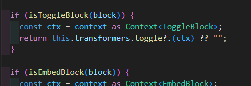
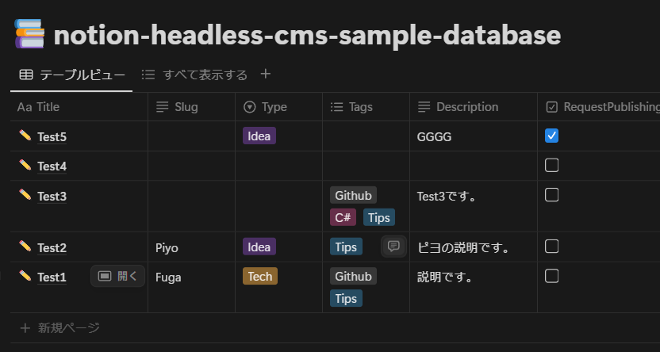

aaaaaaa  
dddddd  

cccccc  
ddddd  

ghgh `gh`gghgh  
hgfhgh `ghg` h  

[https://zenn.dev/keitakn/scraps/9641870e35b51f](https://zenn.dev/keitakn/scraps/9641870e35b51f)  

## 見出し2
見出し2-1


> hogehoge  
> ssssssssss  
> 
> 
> ``` powershell
> $env:PATH += ";C:\Windows\System32"
> 
> Set-ExecutionPolicy RemoteSigned -Scope CurrentUser
> 
> iwr -useb get.scoop.sh | iex
> ```
> 
>   
> 
> ---
> 
> 
> weqweqewqw  
> fghfghfghf  
> > ddddddd  
> > sssddsdsd  
> >  
> > > sdsds  
> 
> jnjnjnjnjnjnj  
> 

> nunuhnhnh  
> 

> 
> tryryrtyyrty  

- ホゲ  
  - ホゲ  
    hghghghg  
  - hoge  
    - aaaaa  
    - sssss  
- ふが  
  - ふが  

1. aaaaasg  
   1. sdsdsgg  
      dddddd  
      - かかかか  
      - たたたた  
      1. はははは  
      2. らららら  
   2. ewewewe  
      1. fdfdf  
      2. ererere  
2. sssssss  
   1. egfgfgf  


> aaaaa  
> sssss  
> ddd  
> ddd  
> 
> 
> > sdsdsds  
> > sbvbvbb  
> > 
> > dsds  
> 
> gggg  

1. かかかか  
2. きききき  
   1. つつつつ  
   2. ふふふふ  
      - asadasda  
      - utueht  
3. んんん  
4. ｋｋｋｋｋ  

  

[](https://x.com/hokazuya/status/1908324323603190190)  

