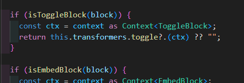
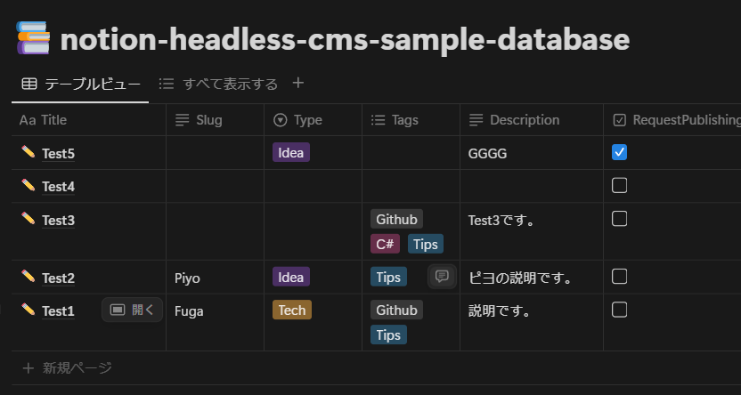

aaaaaaa  
dddddd  

cccccc  
ddddd  

ghgh `gh`gghgh  
hgfhgh `ghg` h  

[https://zenn.dev/keitakn/scraps/9641870e35b51f](https://zenn.dev/keitakn/scraps/9641870e35b51f)  
[https://zenn.dev/keitakn/scraps/9641870e35b51f](https://zenn.dev/keitakn/scraps/9641870e35b51f)  
[https://zenn.dev/keitakn/scraps/9641870e35b51f](https://zenn.dev/keitakn/scraps/9641870e35b51f)  
https://www.slideshare.net/slideshow/dxdevopstechlive/229735702
https://github.com/salvage0707/notion-md-converter/blob/main/packages/notion-md-converter-core/src/transformer/createMarkdownEmbedTransformer.ts

## 見出し2
見出し2-1


> hogehoge  
> ssssssssss  
> 
> 
> ```powershell
> $env:PATH += ";C:\Windows\System32"
> 
> Set-ExecutionPolicy RemoteSigned -Scope CurrentUser
> 
> iwr -useb get.scoop.sh | iex
> ```
> 
>   
> 
> ---
> 
> 
> weqweqewqw  
> fghfghfghf  
> > ddddddd  
> > sssddsdsd  
> >  
> > > sdsds  
> 
> jnjnjnjnjnjnj  
> 

> nunuhnhnh  
> 

> 
> tryryrtyyrty  

- ホゲ  
  - ホゲ  
    hghghghg  
  - hoge  
    - aaaaa  
    - sssss  
- ふが  
  - ふが  

1. aaaaasg  
   1. sdsdsgg  
      dddddd  
      - かかかか  
      - たたたた  
      1. はははは  
      2. らららら  
   2. ewewewe  
      1. fdfdf  
      2. ererere  
2. sssssss  
   1. egfgfgf  


> aaaaa  
> sssss  
> ddd  
> ddd  
> 
> 
> > sdsdsds  
> > sbvbvbb  
> > 
> > dsds  
> 
> gggg  

1. かかかか  
2. きききき  
   1. つつつつ  
   2. ふふふふ  
      - asadasda  
      - utueht  
3. んんん  
4. ｋｋｋｋｋ  

  

https://x.com/hokazuya/status/1908324323603190190

https://www.youtube.com/watch?v=mEUfiX_JIT0  
[mov_hts-samp001.mp4](2A50A837AA497902400A27CADD7C3EAF.mp4)  


[https://www.pref.aichi.jp/kenmin/shohiseikatsu/education/pdf/student_guide.pdfhttps://www.pref.aichi.jp/kenmin/shohiseikatsu/education/pdf/student_guide.pdf](https://www.pref.aichi.jp/kenmin/shohiseikatsu/education/pdf/student_guide.pdf)  
[https://www.pref.aichi.jp/kenmin/shohiseikatsu/education/pdf/student_guide.pdf](https://www.pref.aichi.jp/kenmin/shohiseikatsu/education/pdf/student_guide.pdf)  
[https://www.pref.aichi.jp/kenmin/shohiseikatsu/education/pdf/student_guide.pdf](https://www.pref.aichi.jp/kenmin/shohiseikatsu/education/pdf/student_guide.pdf)  
[https://www.pref.aichi.jp/kenmin/shohiseikatsu/education/pdf/student_guide.pdf](https://www.pref.aichi.jp/kenmin/shohiseikatsu/education/pdf/student_guide.pdf)  

[hoge.pdf](6463DDC250CE7329E03E07BED5B1B122.pdf)  
[hoge.pdf](8F8145E845491DF60E228C83BDA0C820.pdf)  

数式ブロックテスト1  

$$
x + y = 1 \\ x^2 + y^1 = 1
$$


数式ブロックテスト2  
$Hoge$  

数式( $x + y = 1 \\ x^2 + y^1 = 1$ )の埋め込みテストです。  

数式( $aaasd$ )の埋め込みテストです。  


同期ブロック  
ああああ  
> sdasdasda  
> 
> > sdasdasda  
> > 


| aaaas          | ddddd   | cccccc |
| -------------- | ------- | ------ |
| 123132         | 453563   | 687978   |
| sdfsdf  <BR>asdasda   | fghfghf   | yuiyui   |
|                |         |        |
|                |         |        |
