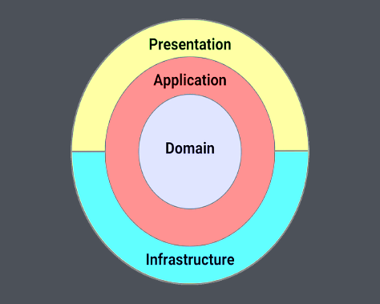

## 1. プレゼンテーション層とは何か
### 語源
もともとはOSI参照モデル（ネットワークの7層モデル）の第6層に由来します。  
```plain text
第7層: アプリケーション層
第6層: プレゼンテーション層  ← データの表現形式を変換する
第5層: セッション層
...
第1層: 物理層
```
この文脈での "presentation" は「内部のデータを外部が理解できる形式に変換すること」を意味します。  
これがソフトウェアアーキテクチャに転用され、「アプリケーション内部のデータを外部（HTTP等）に見せられる形に変換する層」をプレゼンテーション層と呼ぶようになりました。  
### 日本で「プレゼン＝発表」になった理由
英語の "presentation" はスライド発表・データ変換・商品陳列など「提示する行為」全般を指します。日本にはバブル期前後にビジネス英語として「プレゼンテーション＝企画発表」という用法が先に定着したため、IT用語としての意味が後から入ってきても「発表」のイメージが固まっていました。  
> **※ presentation**  
> 1. 提示；呈示  
> 2. 発表；説明；プレゼンテーション  
> 3. 贈呈；授与  
> 4. 提出；提供  
### OSIのプレゼンテーション層がない場合の問題
データの「表現形式」を統一する役割がなくなるため、異なるシステム間で通信が成立しなくなります。  
- 文字コードの違いによる文字化け（ASCIIとEBCDICの変換ができない）  
- 暗号化・復号の標準がなくなる（TLS/SSLはここに位置する）  
- 画像・動画のフォーマット変換ができなくなる  
**プレゼンテーション層で使われるプロトコル・規格：** SSL/TLS、MIME、JPEG/PNG/MPEG、ASN.1、XDR  
---
## 2. 各層の責務
### サンプルコード（Clean Architecture + Todo API）
**プレゼンテーション層（Web.Api/Endpoints）**  
```c#
public void MapEndpoint(IEndpointRouteBuilder app)
{
    app.MapPost("todos", async (
        Request request,
        ICommandHandler<CreateTodoCommand, Guid> handler,
        CancellationToken cancellationToken) =>
    {
        // HTTPリクエストをアプリ層の言葉に翻訳する
        var command = new CreateTodoCommand
        {
            UserId = request.UserId,
            Description = request.Description,
        };

        Result<Guid> result = await handler.Handle(command, cancellationToken);

        // 結果をHTTPレスポンスに翻訳して返す
        return result.Match(Results.Ok, CustomResults.Problem);
    });
}
```
**アプリケーション層（Application/Todos/Create）**  
```c#
public async Task<Result<Guid>> Handle(CreateTodoCommand command, CancellationToken cancellationToken)
{
    // ユーザーの権限チェック
    if (userContext.UserId != command.UserId)
        return Result.Failure<Guid>(UserErrors.Unauthorized());

    // ユーザーの存在確認
    User? user = await context.Users
        .SingleOrDefaultAsync(u => u.Id == command.UserId, cancellationToken);

    // TodoItemを作成してDBに保存（HTTPのことは一切知らない）
    var todoItem = new TodoItem { ... };
    context.TodoItems.Add(todoItem);
    await context.SaveChangesAsync(cancellationToken);

    return todoItem.Id;
}
```
### 層ごとの知識範囲
| 層          | 知っていること           | 知らないこと           |
| ---------- | ----------------- | ---------------- |
| プレゼンテーション層   | HTTPリクエスト/レスポンスの形   | ビジネスルール、DBの実装    |
| アプリケーション層   | ユースケースの手順、何を呼ぶか   | HTTPの存在、DBの具体的実装   |
| ドメイン層      | ビジネスルールそのもの       | HTTP、DB、処理の手順    |
| インフラ層      | DBやAPIなど外部システムの実装   | ビジネスルール          |
### 一言定義
- **プレゼンテーション層**：「外の世界（HTTP等）」と「アプリの世界」の通訳。**見せ方を担当する。**  
- **アプリケーション層**：ユースケースを実現するための手順を指揮するオーケストレーター。**何をどの順番でやるかを決める。**  
- **ドメイン層**：ビジネスルールそのもの。最も技術的な依存が少ない。  
- **インフラ層**：DB・外部API・ファイルシステムなど技術的実装。  
### プレゼンテーション層とインフラ層の違い
どちらも「外との境界」ですが、**向いている方向が根本的に違います**。  
  
```plain text
ユーザー（人間）
    ↕  ← プレゼンテーション層（人間 ↔ アプリの境界）
アプリケーション層
    ↕  ← インフラ層（アプリ ↔ 別プログラムの境界）
DB・外部API（プログラム）
```
|         | プレゼンテーション層     | インフラ層               |
| ------- | -------------- | ------------------- |
| 境界の相手   | ユーザー（人間）       | DB・外部API（プログラム）     |
| ユーザーの関与   | あり             | なし（ユーザーは存在を知らない）    |
| 役割      | 人間が理解できる形に変換する   | プログラムが理解できる形でやり取りする   |
同心円図ではPresentationもInfrastructureも「外側」に位置しますが、Presentationは**人間側**に、Infrastructureは**システム側**に面しています。どちらも「外との境界」ですが「誰との境界か」が違います。  
### なぜ分けるのか
変更の理由が違うからです。各層は**それぞれ異なる理由で変更が起きる**ため、変更の影響範囲を最小化できます。  
**プレゼン層を差し替えることで、同じビジネスロジックを複数の接点から提供できます。**  
```plain text
スマホアプリ（JSON）  ─┐
Webブラウザ（HTML）   ─┤─▶ アプリ層（Todoを作る処理） ─▶ インフラ層（DB）
CLI（標準入出力）     ─┘
```
- Todoを作るビジネスロジックは1つ  
- プレゼン層を追加するだけで新しい接点を増やせる（アプリ層は無変更）  
- 「Todoを作ったらメール通知する」変更はアプリ層だけ触ればよく、全接点に自動で適用される  
---
## 3. OSIとCAで「アプリケーション」が逆を向く理由
### OSIモデルのアプリケーション層
```plain text
ユーザー
   ↕
第7層: アプリケーション層  ← HTTP, FTP, SMTPなど（最も外側・上位）
```
「エンドユーザーが使うソフトウェアが直接利用する層」という意味です。  
ユーザーが直接HTTPを操作しているわけではありません。ブラウザというソフトウェアがHTTPを使っています。ユーザーが触るのはブラウザのUI（HTML）で、HTTPはその裏側で動く通信プロトコルです。  
```plain text
ユーザーが見る世界：  HTMLの画面・ブラウザのUI
                          ↕
ブラウザが使うもの：  HTTP（通信プロトコル） ← OSIアプリケーション層
                          ↕
ネットワーク：        TCP/IPなど下位層
```
### ソフトウェアアーキテクチャのアプリケーション層
```plain text
外の世界（HTTP）
   ↕
プレゼンテーション層
   ↕
アプリケーション層  ← ユースケースの指揮者（内部に存在）
   ↕
ドメイン層
```
「ビジネスロジックをオーケストレーションする内部の層」という意味です。外側と内側の中間に位置し、ドメインとインフラを用いて処理を指揮します。  
### なぜ同じ「アプリケーション」という言葉なのか
OSIでは**「ソフトウェア」**の意味、CAでは**「適用」**の意味として、それぞれ独立して命名されました。同じ単語の別の意味がたまたま使われてしまった典型例です。  
| モデル | "application" の意味 | 視点                | 層の位置     |
| --- | ----------------- | ----------------- | -------- |
| OSI   | ③ ソフトウェア          | 物理信号からアプリまでどう届けるか   | 最も外側（上位）   |
| CA   | ① 適用・応用           | ビジネスルールをどう守るか     | 中間（内部寄り）   |
> **※ application**  
> 1. 適用；応用  
> 2. 申し込み；申請；出願  
> 3. ソフトウェア；アプリケーション  
> 4. 勤勉；専念  
---
## 参考ソース
| 内容                                   | URL                                                                                       |
| ------------------------------------ | ----------------------------------------------------------------------------------------- |
| OSIモデル全般（Wikipedia）                  | https://en.wikipedia.org/wiki/OSI_model                                                   |
| OSIモデル解説（Cloudflare）                 | https://www.cloudflare.com/learning/ddos/glossary/open-systems-interconnection-model-osi/   |
| OSIモデル解説（AWS）                        | https://aws.amazon.com/what-is/osi-model/                                                 |
| プレゼンテーション層詳細（GeeksforGeeks）          | https://www.geeksforgeeks.org/computer-networks/presentation-layer-in-osi-model/          |
| アプリケーション層（Wikipedia）                 | https://en.wikipedia.org/wiki/Application_layer                                           |
| CAのアプリケーション層・ユースケース（Milan Jovanovic）   | https://www.milanjovanovic.tech/blog/building-your-first-use-case-with-clean-architecture   |

